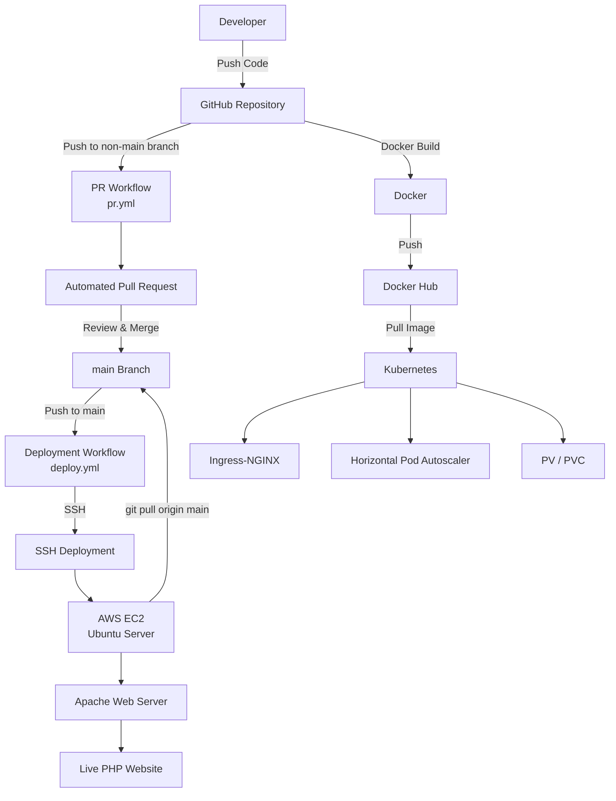

# 🚀 PHP Application CI/CD Deployment with Docker, Kubernetes, GitHub Actions & AWS EC2

## 🌟 Overview

This project demonstrates a complete **DevOps and CI/CD workflow** for a PHP-based web application, combining Docker, Kubernetes, GitHub Actions, automated Pull Requests, and automated deployment to an AWS EC2 server.

The project includes:

* ✅ PHP-based web application
* ✅ Dockerized application
* ✅ Docker image management with Docker Hub
* ✅ Kubernetes deployment using **Kubeadm**
* ✅ **Ingress-NGINX Controller**
* ✅ Horizontal Pod Autoscaler (**HPA**)
* ✅ Persistent Volume (**PV**) and Persistent Volume Claim (**PVC**)
* ✅ GitHub-based version control
* ✅ Automated Pull Request creation using GitHub Actions
* ✅ Automated deployment to AWS EC2 using GitHub Actions
* ✅ SSH-based deployment using a GitHub Secret
* ✅ Automated email notifications
* ✅ Basic deployment rollback handling
* ✅ Live deployment through a custom domain

---

# 🏗️ Architecture

The project combines the application deployment infrastructure with an automated GitHub Actions CI/CD workflow.



---

# 🔄 CI/CD Pipeline

The project contains two GitHub Actions workflows:

| Workflow     | Purpose                                                     | Trigger                          |
| ------------ | ----------------------------------------------------------- | -------------------------------- |
| `pr.yml`     | Automatically creates Pull Requests and sends notifications | Push to any branch except `main` |
| `deploy.yml` | Deploys the application to AWS EC2                          | Push to `main`                   |

The overall workflow is:

```text
Developer
    │
    ▼
GitHub Repository
    │
    ├── Push to development/feature branch
    │
    ▼
PR Workflow (pr.yml)
    │
    ▼
Automated Pull Request
    │
    ▼
Review & Merge
    │
    ▼
main branch
    │
    ▼
Deployment Workflow (deploy.yml)
    │
    ▼
GitHub Actions
    │
    ▼
SSH Authentication
    │
    ▼
AWS EC2 Ubuntu Server
    │
    ▼
git pull origin main
    │
    ▼
Apache Web Server
    │
    ▼
🌐 Live Website
```

---

# 🔀 Pull Request Automation

### Workflow: `.github/workflows/pr.yml`

The Pull Request workflow is triggered whenever code is pushed to a branch other than `main`.

### Workflow Process

```text
Push to development/feature branch
              ↓
       GitHub Actions
              ↓
      Checkout Repository
              ↓
    Automatic Pull Request
              ↓
        Review & Merge
              ↓
      Email Notification
```

The workflow uses:

* `actions/checkout@v3`
* `diillson/auto-pull-request@v1.0.1`
* GitHub `TOKEN` secret
* Automatic Pull Request title and description
* `auto-pr` label
* Automatic assignment
* Gmail SMTP notification

The Pull Request is automatically created and can then be reviewed before merging into `main`.

---

# 🚀 Automated Deployment

### Workflow: `.github/workflows/deploy.yml`

The deployment workflow runs when changes are pushed to the `main` branch.

### Deployment Process

```text
Merge Pull Request into main
              ↓
       GitHub Actions
              ↓
        Checkout Code
              ↓
      Configure SSH Agent
              ↓
       Connect to AWS EC2
              ↓
   Navigate to application
          directory
              ↓
      git pull origin main
              ↓
      Update application
              ↓
     Configure Apache ownership
              ↓
       Live Application
              ↓
      Email Notification
```

The workflow uses the `CICD_SSH_KEY` GitHub Secret to authenticate securely with the EC2 server.

The application deployment directory on the server is:

```text
/var/www/html/businesslogodesign-dockerkube
```

The server pulls the latest version of the `main` branch from GitHub.

---

# 🔐 Security & Secrets

Sensitive credentials are intended to be stored as **GitHub Actions Secrets** rather than directly inside workflow files.

The project uses:

```text
TOKEN
CICD_SSH_KEY
```

### `TOKEN`

Used by the Pull Request workflow to authenticate the automatic Pull Request creation.

### `CICD_SSH_KEY`

Used by the deployment workflow to establish an SSH connection from GitHub Actions to the AWS EC2 server.

> ⚠️ Never commit private keys, Personal Access Tokens, or Gmail app passwords directly into the repository.

---

# 📧 Email Notifications

Both workflows include Gmail SMTP notifications.

### Pull Request Notification

The PR workflow sends an email containing:

* Repository
* Branch
* Pull Request number
* Pull Request review link

### Deployment Notification

The deployment workflow sends an email after deployment containing:

* Repository
* Branch
* Deployment information
* Live website URL

---

# 🐳 Docker

The PHP application is containerized using Docker.

The project includes a `Dockerfile` used to define the application container environment.

Docker is used as part of the application's containerization and deployment workflow, while Docker Hub is used for image management.

---

# ☸️ Kubernetes

The project also includes a Kubernetes deployment architecture using **Kubeadm**.

The Kubernetes environment includes:

### Ingress-NGINX

Used to handle incoming HTTP traffic and route requests to the appropriate application service.

### Horizontal Pod Autoscaler

The HPA allows application workloads to scale based on resource utilization.

### Persistent Storage

The project includes:

* Persistent Volume (**PV**)
* Persistent Volume Claim (**PVC**)

These provide persistent storage for workloads running in Kubernetes.

---

# ☁️ AWS EC2 Deployment

The application is deployed to an **Ubuntu AWS EC2 instance**.

The GitHub Actions deployment workflow connects to the EC2 instance using SSH and updates the application from the `main` branch.

The deployment architecture is:

```text
GitHub
   │
   ▼
GitHub Actions
   │
   │ SSH
   ▼
AWS EC2
   │
   ▼
Ubuntu
   │
   ▼
Apache
   │
   ▼
PHP Application
   │
   ▼
Live Website
```

---

# 🛡️ Deployment Rollback

The deployment workflow records the current commit before attempting to pull the latest code.

```bash
LAST_COMMIT=$(git rev-parse HEAD)
echo $LAST_COMMIT > .last_commit
```

If the pull operation fails, the workflow attempts to restore the previous commit:

```bash
git reset --hard $(cat .last_commit)
```

This provides a basic rollback mechanism to help prevent an unsuccessful deployment from leaving the application in an inconsistent Git state.

---

# 🌐 Live Application

The successfully deployed application is available at:

**https://cicd.ressenza.pk**

The application was successfully deployed to the AWS EC2 server through the GitHub Actions deployment pipeline.

> **Note:** The website is hosted on the EC2 instance. If the EC2 instance is stopped, the website will be temporarily unavailable until the instance is started again.

---

# 📸 Screenshots

The following screenshots document the implementation and successful testing of the CI/CD workflow.

## GitHub Repository

The GitHub repository contains the application source code and GitHub Actions workflow files.


---

## 🔀 Pull Request Automation

### Successful PR Workflow

The GitHub Actions Pull Request workflow successfully executes after code is pushed to a non-main branch.


### PR Workflow Checks

The individual workflow steps are shown completing successfully.


### Pull Request Approval Email

The automated email notification requesting Pull Request review.


---

## 🚀 Automated Deployment

### Successful Deployment Workflow

The deployment workflow successfully runs after changes are merged into `main`.


### Deployment Workflow Checks

The individual deployment steps are shown completing successfully.


### Deployment Notification

The automated email notification confirms that the deployment has been completed.


---

## ☁️ AWS EC2 Infrastructure

The AWS EC2 instance used as the deployment server.


---

## 🔄 CI/CD Pipeline Verification

GitHub Actions showing the successful execution of both the Pull Request and deployment workflows.


---

## 🔧 Git Repository Synchronization

During deployment testing, the EC2 repository was synchronized with the GitHub repository using `git fetch origin`.


This was part of troubleshooting a Git branch divergence issue encountered during the initial deployment test.

---

## 🌐 Live Deployment

The final result of the CI/CD pipeline — the PHP application successfully deployed and accessible through the configured domain.


---

# 📊 Project Workflow Summary

| Stage            | Technology     | Purpose                                |
| ---------------- | -------------- | -------------------------------------- |
| Source Code      | Git / GitHub   | Version control                        |
| Containerization | Docker         | Package application                    |
| Image Management | Docker Hub     | Store Docker images                    |
| Orchestration    | Kubernetes     | Application deployment                 |
| Ingress          | Ingress-NGINX  | Route incoming traffic                 |
| Scaling          | HPA            | Automatic workload scaling             |
| Storage          | PV / PVC       | Persistent application storage         |
| PR Automation    | GitHub Actions | Automatically create Pull Requests     |
| CI/CD            | GitHub Actions | Automate deployment                    |
| Server           | AWS EC2        | Host deployed application              |
| Operating System | Ubuntu         | EC2 server environment                 |
| Web Server       | Apache         | Serve the PHP application              |
| Authentication   | SSH            | Secure GitHub Actions → EC2 connection |
| Notifications    | Gmail SMTP     | PR and deployment notifications        |

---

# 🧪 Testing & Verification

The CI/CD implementation was tested end-to-end.

### Pull Request Pipeline

* Code was pushed to a non-main branch.
* GitHub Actions triggered the PR workflow.
* A Pull Request was automatically created.
* Email notification was generated.
* The Pull Request was reviewed and merged into `main`.

### Deployment Pipeline

* The merge into `main` triggered the deployment workflow.
* GitHub Actions successfully authenticated with the EC2 server.
* The EC2 repository was synchronized with GitHub.
* The application deployment completed successfully.
* Deployment notification was generated.
* The live website was successfully served from the deployed server.

Both pipelines were successfully tested, and the final deployment confirmed that the complete CI/CD workflow was operational.

---

# 🛠️ Technologies Used

* **Git**
* **GitHub**
* **GitHub Actions**
* **GitHub Actions Secrets**
* **Docker**
* **Docker Hub**
* **Kubernetes**
* **Kubeadm**
* **Ingress-NGINX**
* **Horizontal Pod Autoscaler**
* **Persistent Volumes / PVC**
* **AWS EC2**
* **Ubuntu**
* **Apache**
* **PHP**
* **SSH**
* **Gmail SMTP**

---

# 🎯 Learning Outcomes

This project demonstrates practical experience with:

* Building and containerizing a web application
* Managing source code with Git and GitHub
* Designing a Git-based development workflow
* Automating Pull Request creation
* Implementing GitHub Actions workflows
* Managing CI/CD secrets
* Establishing SSH-based automated deployment
* Deploying applications to AWS EC2
* Managing application deployment through Git
* Implementing basic rollback handling
* Working with Docker and Docker Hub
* Deploying workloads with Kubernetes
* Configuring Kubernetes ingress, scaling, and persistent storage
* Troubleshooting Git branch synchronization
* Troubleshooting and validating automated deployments

---

# 👨‍💻 Project

**Business Logo Design — Automated DevOps & CI/CD Deployment**

This project demonstrates how a PHP web application can move from source code to a live environment through an automated GitHub-based CI/CD workflow, while also incorporating Docker and Kubernetes deployment technologies.

### Live Website

**https://cicd.ressenza.pk**
